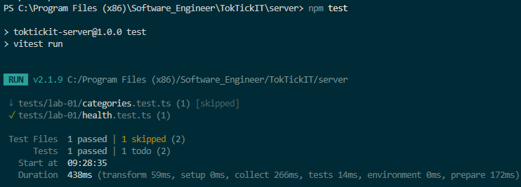
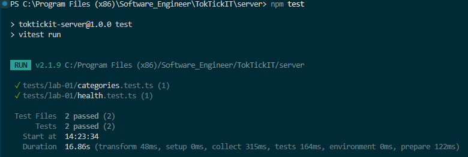
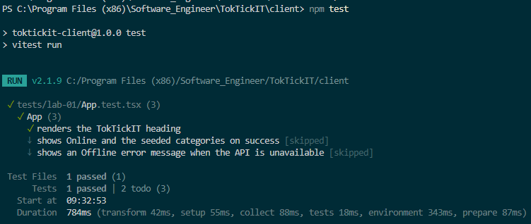
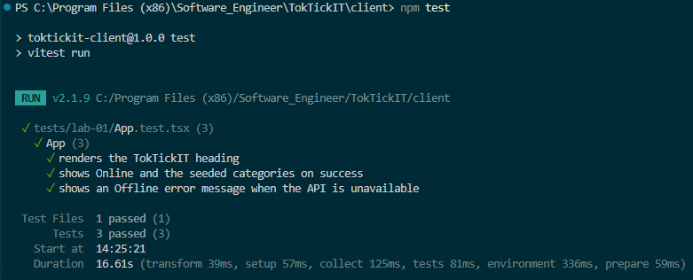
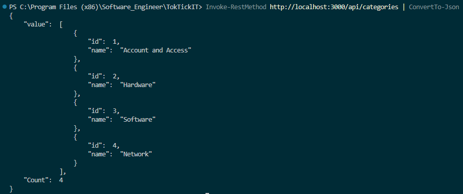
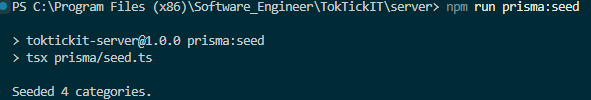
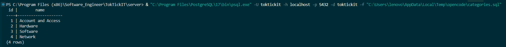
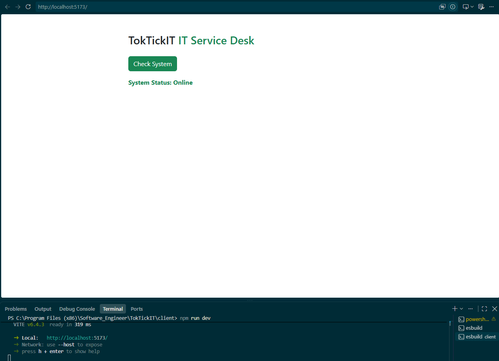
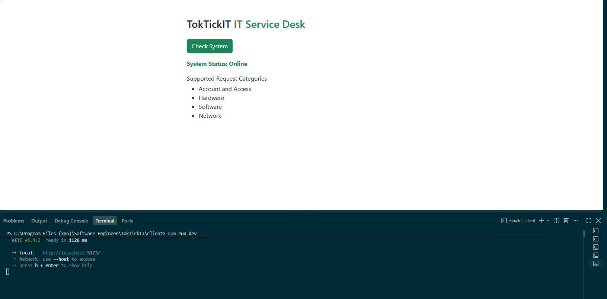
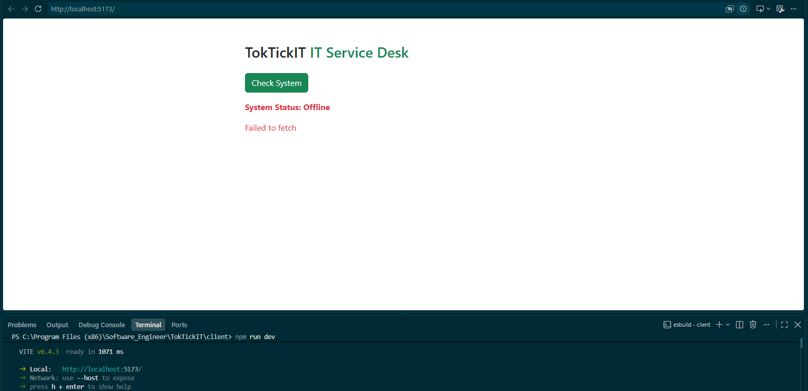

# Lab 1 — Test Plan and Evidence

All test files live under server/tests/lab-01/ and client/tests/lab-01/.

| # | Tool | Test | Result |
|---|------|------|--------|
| 1 | Supertest | GET /api/health returns 200, status=ok | Passed |
| 2 | Supertest | GET /api/categories returns 4 seeded categories in id order | Passed |
| 3 | Vitest | Heading renders | Passed |
| 4 | Vitest | Success state shows Online + category list | Passed |
| 5 | Vitest | Error state shows Offline + message | Passed |

## Server tests

### API-01: GET /api/health

### API-02: GET /api/categories

## Client tests

### UI-01: Heading renders

### UI-02/UI-03: Online + Offline states

## Live API evidence

### GET /api/categories ตอบจาก PostgreSQL

## Issue 3 evidence

### Seed 4 categories (idempotent)

### Database มี 4 categories

## UI demo

### System status จาก localhost

### รายการหมวดหมู่จาก API

### Error state (Offline) หน้าเว็บจริง

